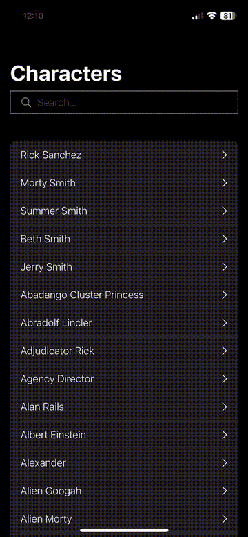

# RiMo-GftNdx
Ricky Morty iOS sample app


## Sample app review


## Features
- 📜 List all characters from Rick and Morty.
- 🔍 Search and filter characters by name.
- 👤 Character details screen with additional information.
- 📷 Image caching for smooth scrolling and performance optimization.
- 🧪 Unit tests to ensure app stability.
- 🎨 Modern UI/UX using SwiftUI (iOS).

## Installation & Setup
1. Clone the repository:
```bash
git clone git@github.com:JaCaLla/RiMo-GftNdx.git
```
2. Open RiMo-GftNdx.xcodeproj in Xcode.

3. Build and run the app on an iPhone simulator or device.

## Tech Stack
- **Swift 6.0**

## Requirements
- **Xcode 16.2 or later**
- **iOS 18.2 or later**
